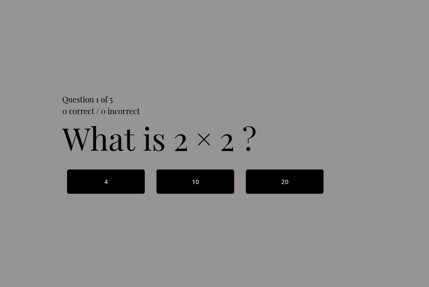

# Math Quiz App

### How to use this Project
Download the files using the git clone command.
```
$ git clone https://github.com/leeb2828/simple_quiz_app
```
A virtual environment is a tool that helps to keep dependencies required by
different projects separate from each other by using isolated virtual environments.
The venv module comes pre installed with Python 3.5 + versions.
Create your virtual environment
```
$ python3 -m venv env
$ source env/bin/activate
```
I created the requirements.txt file using the pip freeze command.
Install all dependencies from the requirements.txt file.
```
$ pip install -r requirements.txt
```
Run the app.py file
```
$ python3 app.py
```
Type in http://localhost:5000 into your browser to view the project live.
Type in CTRL-C to stop running the server.

To deactivate your environment:
```
$ deactivate
```
## About this Project 
HTML, CSS, and Python Flask were used for this project. I wrote all of the backend and modified a little bit of the CSS. All of the quiz questions are fetched from a json file. A math question appears on the page with three different button options; two incorrect options and one correct option. When the user answers correctly, the buttons options will disappear and will be replaced by a "NEXT QUESTION" button and text that will let the user know they answered correctly. It will let the user know if they answered incorrectly. This app also keeps a tally of the number of correct and incorrect answers, and displays it to the screen. 
<br />




